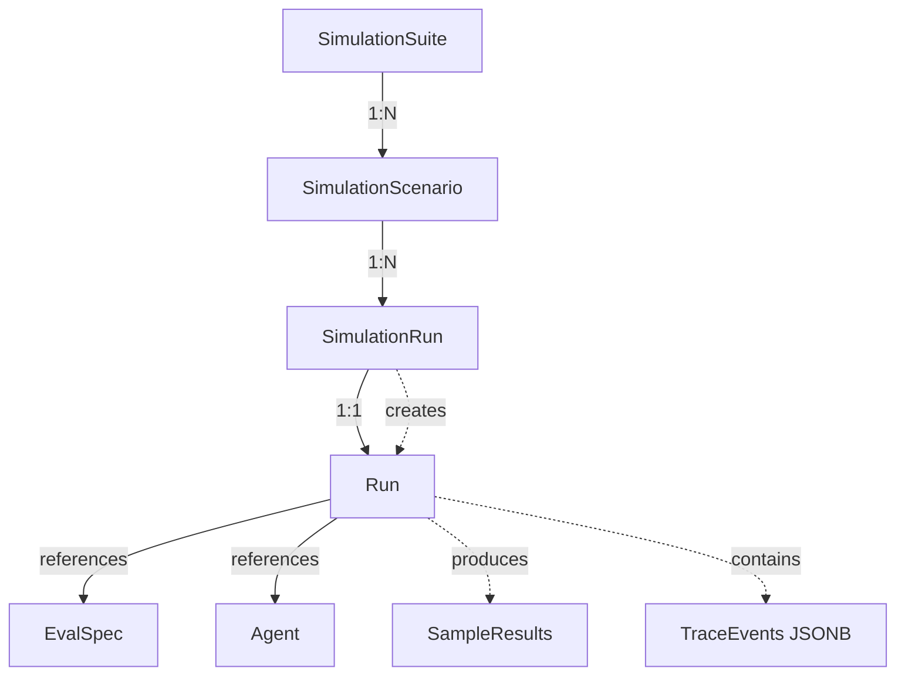

# Simulations Architecture

## Overview

Simulations enable multi-turn conversation testing of agents by orchestrating a series of user messages and validating agent responses. Each simulation execution produces a standard EvalOps `Run` record, allowing simulations to leverage existing evaluation infrastructure (policies, metrics, trace events).

## Architecture Decision: Simulations in evaluation-service

**Decision**: Simulations are implemented in `evaluation-service` rather than as a separate service or in `core-service`.

### Rationale

1. **Owns runs lifecycle**: `evaluation-service` already manages the `runs` table lifecycle (creation, status updates, completion). Simulations produce `Run` records, so it's natural for the same service to orchestrate simulation execution.

2. **Has evaluator infrastructure**: Judge calls (LLM-based evaluations) use the existing evaluator infrastructure in `evaluation-service`. Simulations need judges to evaluate agent responses at each turn.

3. **Has trace ingestion**: The ingestion endpoint (`POST /api/evaluation/ingestion/events`) lives in `evaluation-service`. Simulations can leverage this to emit trace events during execution.

4. **Has policy evaluation**: Policy engine runs in `evaluation-service`. Simulation runs can be evaluated against policies just like standard evaluation runs.

5. **Minimal cross-service calls**: While simulations need agent definitions (from `core-service`), most orchestration stays local. The `CoreClientModule` provides a clean abstraction for fetching agent definitions when needed.

### Alternative Considered: Separate Service

**Rejected** because:
- Would require duplicating run creation logic
- Would need to duplicate evaluator infrastructure
- Would increase operational complexity (another service to deploy/monitor)
- Cross-service communication overhead for what is fundamentally an evaluation workflow

### Alternative Considered: core-service

**Rejected** because:
- `core-service` focuses on CRUD operations (prompts, datasets, agents, eval specs)
- Evaluation execution logic lives in `evaluation-service`
- Would create tight coupling between core and evaluation domains

## Domain Model

### Entity Relationships



### Core Entities

#### SimulationSuite

A **versioned collection** of simulation scenarios with shared configuration.

- **Purpose**: Groups related scenarios that test similar agent behaviors or use cases
- **Key attributes**:
  - `id`: UUID primary key
  - `name`: Human-readable name (e.g., "Customer Support Agent Tests")
  - `version`: Semantic version string (e.g., "1.0.0")
  - `description`: Optional description of the suite's purpose
  - `config`: JSONB configuration (timeouts, retry policies, default judge settings)
  - `organizationId`: Tenant isolation
  - `createdBy`: User who created the suite
  - `createdAt`: Timestamp
- **Database**: `simulation_suites` table in `libs/shared-db/src/lib/schema/evaluation.ts`

#### SimulationScenario

A **step graph / turn list** defining a multi-turn conversation flow.

- **Purpose**: Defines a single test scenario with user messages, tool availability, and stopping criteria
- **Key attributes**:
  - `id`: UUID primary key
  - `suiteId`: Foreign key to `simulation_suites.id`
  - `name`: Human-readable name (e.g., "Order Status Inquiry")
  - `order`: Integer for ordering scenarios within a suite
  - `definition`: JSONB containing:
    - `turns`: Array of turn definitions
      - `userMessage`: Template string or deterministic message
      - `allowedTools`: Array of tool names available in this turn
      - `assertions`: Optional expectations (schema validation, regex, rubric tags)
      - `terminationRules`: Max turns, stop tokens, judge verdict thresholds
  - `organizationId`: Tenant isolation
  - `createdAt`: Timestamp
- **Database**: `simulation_scenarios` table in `libs/shared-db/src/lib/schema/evaluation.ts`

#### SimulationRun

An **execution instance** that produces a standard EvalOps `run` + trace.

- **Purpose**: Links a simulation execution to the existing `runs` table
- **Key attributes**:
  - Links to existing `runs` table via `runId` (foreign key)
  - `suiteId`: Foreign key to `simulation_suites.id`
  - `scenarioId`: Foreign key to `simulation_scenarios.id`
  - `organizationId`: Tenant isolation
  - `createdAt`: Timestamp
- **Database**: `simulation_runs` table in `libs/shared-db/src/lib/schema/evaluation.ts`

**Note**: Simulation runs reuse the existing `runs` table structure. The simulation-specific metadata is stored in the linking table, and the run itself follows the standard pattern (status, decision, metrics, traceEvents, etc.).

## Execution Flow

### High-Level Flow

1. **User initiates simulation**: `POST /api/evaluation/simulations/scenarios/:scenarioId/run`
2. **SimulationRunnerService**:
   - Fetches scenario definition from database
   - Fetches agent definition from `core-service` (via `CoreClientService`)
   - Creates a `Run` record with name: `"Sim: <suite>/<scenario>"`
   - Executes turns sequentially:
     - Sends user message to agent
     - Waits for agent response
     - Validates response (assertions, judge evaluation)
     - Checks termination rules
     - Emits trace events to `runs.trace_events` JSONB column
   - Updates run status (completed/failed)
   - Evaluates policies against run results
   - Returns run ID

### Turn Execution Details

For each turn in the scenario:

1. **Prepare user message**: Resolve template variables if present
2. **Call agent**: Use agent's LLM provider to generate response
   - Respect `allowedTools` constraint (filter tool calls if needed)
   - Emit trace events: `assistant_message`, `tool_call`, `tool_result`, etc.
3. **Validate response**:
   - Schema validation (if `assertions.schema` present)
   - Regex matching (if `assertions.regex` present)
   - Judge evaluation (if `assertions.rubricTags` present)
4. **Check termination**:
   - Max turns reached?
   - Stop tokens found?
   - Judge verdict threshold met?
5. **Continue or terminate**: If not terminated, proceed to next turn

### Integration with Existing Infrastructure

#### Runs Table

Simulations create standard `Run` records:
- `name`: `"Sim: <suite-name>/<scenario-name>"`
- `status`: `"completed"` or `"failed"`
- `decision`: Policy evaluation result (`"pass"`, `"warn"`, `"fail"`)
- `traceEvents`: JSONB array of OTLP-shaped spans
- `metrics`: Cost, latency, token usage aggregated across all turns

#### Trace Events

Simulations emit trace events in the same format as SDK ingestion:
- `assistant_message`: Agent's response
- `user_message`: User's input
- `tool_call`: Tool invocation
- `tool_result`: Tool response
- `judge_evaluation`: Judge verdict and reasoning

Events are appended to `runs.trace_events` JSONB column (10 MB cap per run).

#### Policy Evaluation

After simulation completes, the existing policy engine evaluates the run:
- Checks pass/fail thresholds
- Evaluates custom policies
- Sets `decision` field on run record

#### Evaluators

Judge evaluations use existing evaluator infrastructure:
- `RuleEvaluator`: Schema validation, regex matching
- `LLMJudgeEvaluator`: Rubric-based evaluation using LLM judge
- Evaluators are configured via `SimulationSuiteConfig.judgeConfig`

## Module Structure

```
apps/evaluation-service/src/app/
  simulations/
    simulations.module.ts          # NestJS module
    simulations.controller.ts      # CRUD + run endpoints
    simulations.service.ts         # Suite/scenario CRUD
    simulation-runner.service.ts  # Execution orchestration
    types.ts                       # TypeScript types (Phase 0)
```

### Dependencies

- **RunsModule**: For creating and updating run records
- **EvaluationModule**: For evaluator infrastructure (judge calls)
- **CoreClientModule**: For fetching agent definitions from `core-service`
- **PoliciesModule**: For policy evaluation after simulation completes

## Database Schema Location

**Decision**: Add simulation tables to `libs/shared-db/src/lib/schema/evaluation.ts`.

**Rationale**:
- Simulations are evaluation-related (they produce runs)
- Keeps evaluation domain together
- Reuses existing RLS patterns
- Follows existing schema organization

## API Surface

### Simulation Suites

- `POST /api/evaluation/simulations/suites` - Create suite
- `GET /api/evaluation/simulations/suites` - List suites
- `GET /api/evaluation/simulations/suites/:id` - Get suite
- `PUT /api/evaluation/simulations/suites/:id` - Update suite
- `DELETE /api/evaluation/simulations/suites/:id` - Delete suite

### Simulation Scenarios

- `POST /api/evaluation/simulations/suites/:suiteId/scenarios` - Create scenario
- `GET /api/evaluation/simulations/suites/:suiteId/scenarios` - List scenarios
- `GET /api/evaluation/simulations/scenarios/:id` - Get scenario
- `PUT /api/evaluation/simulations/scenarios/:id` - Update scenario
- `DELETE /api/evaluation/simulations/scenarios/:id` - Delete scenario

### Simulation Runs

- `POST /api/evaluation/simulations/scenarios/:scenarioId/run` - Execute scenario
- `POST /api/evaluation/simulations/suites/:suiteId/run` - Execute all scenarios in suite
- `GET /api/evaluation/simulations/runs/:runId` - Get simulation run details

## Naming Conventions

### Database Tables

- `simulation_suites` (snake_case, plural)
- `simulation_scenarios` (snake_case, plural)
- `simulation_runs` (snake_case, plural) - linking table

### TypeScript Types

- `SimulationSuite` (PascalCase, singular)
- `SimulationScenario` (PascalCase, singular)
- `SimulationRun` (PascalCase, singular)
- `SimulationTurn` (PascalCase, singular)

### API Routes

- `/api/evaluation/simulations/` (kebab-case, plural)

### Service Classes

- `SimulationsService` (PascalCase)
- `SimulationRunnerService` (PascalCase)

## Future Phases

### Phase 1 (Next)

- Database schema implementation (Drizzle tables)
- `SimulationRunnerService` implementation
- Basic CRUD endpoints
- Integration with existing run creation flow

### Phase 2 (Future)

- OTLP trace ingestion (full OpenTelemetry support)
- Advanced termination rules
- Scenario templates
- Bulk execution optimizations

### Phase 3 (Future)

- Frontend UI for scenario editor
- Visual turn-by-turn execution view
- Scenario versioning and diffing
- Suite execution scheduling
